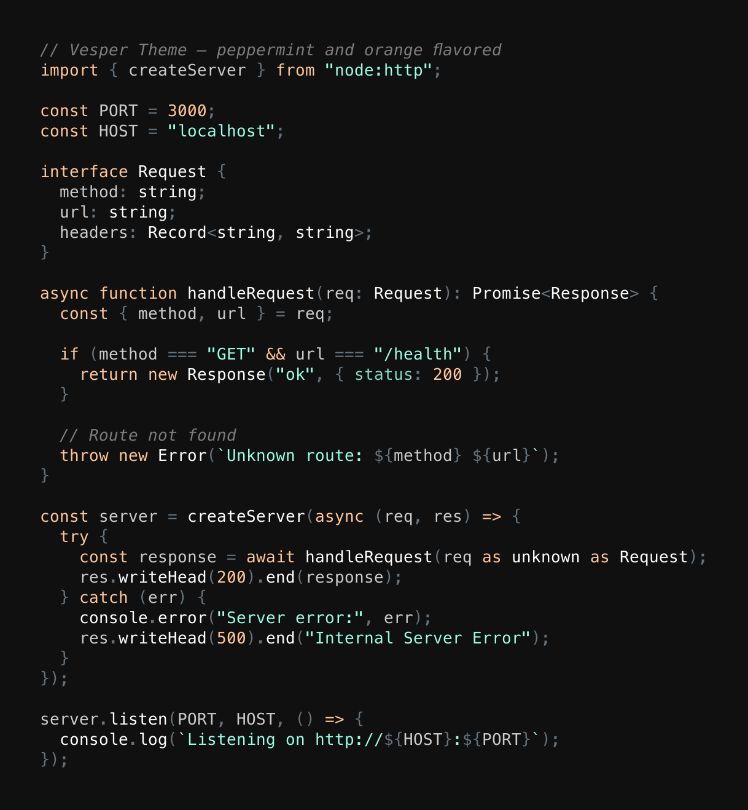
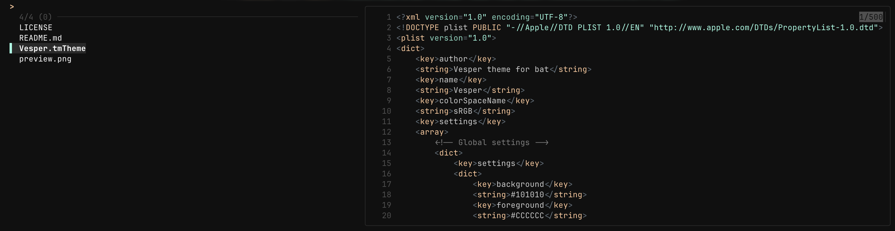

# Vesper for bat & Sublime Text

[](LICENSE)

Peppermint and orange flavored dark theme for [bat](https://github.com/sharkdp/bat) and any TextMate-compatible app. Port of the [Vesper](https://github.com/raunofreiberg/vesper) VS Code theme by [Rauno Freiberg](https://github.com/raunofreiberg).



### As fzf preview



## Color Palette

| Role               | Color     | Hex       |
| ------------------- | --------- | --------- |
| Background          |  | `#101010` |
| Foreground          |  | `#CCCCCC` |
| Strings             |  | `#99FFE4` |
| Keywords / Constants |  | `#FFC799` |
| Comments            |  | `#7D7D7D` |
| Errors              |  | `#FF8080` |
| Operators           |  | `#65737E` |
| Functions           |  | `#FFFFFF` |

## Installation

### bat

1. Copy the theme file to bat's theme directory:

   ```sh
   cp Vesper.tmTheme "$(bat --config-dir)/themes/"
   ```

2. Rebuild the bat cache:

   ```sh
   bat cache --build
   ```

3. Use the theme:

   ```sh
   bat --theme=Vesper file.txt
   ```

   Or add it to your bat config file (`bat --config-file`):

   ```
   --theme="Vesper"
   ```

### Sublime Text

1. Copy `Vesper.tmTheme` to your Sublime Text Packages/User directory:
   - **macOS:** `~/Library/Application Support/Sublime Text/Packages/User/`
   - **Linux:** `~/.config/sublime-text/Packages/User/`
   - **Windows:** `%APPDATA%\Sublime Text\Packages\User\`

2. Select the theme via **Preferences > Color Scheme > Vesper**.

## Credits

Based on the [Vesper](https://github.com/raunofreiberg/vesper) VS Code theme by [Rauno Freiberg](https://github.com/raunofreiberg).

## License

[MIT](LICENSE)
